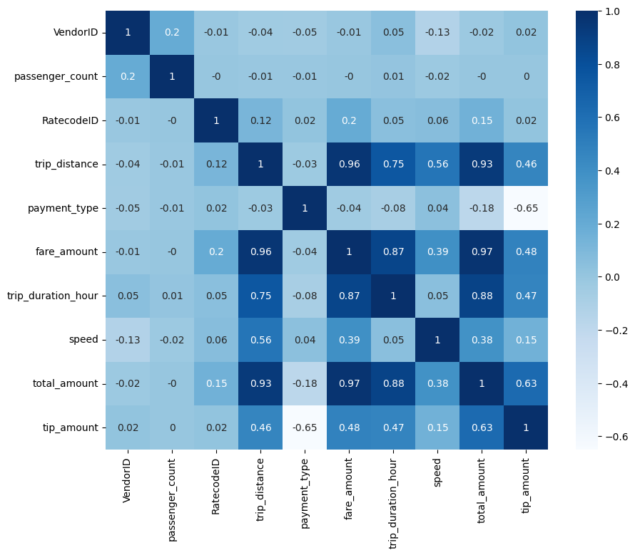
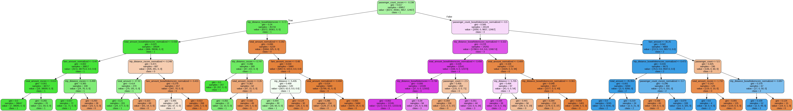

# NYC Yellow Taxi Trip Data Analysis
## Overview
This project analyzes **New York City Yellow Taxi trip data** to explore patterns in taxi usage and apply basic data mining and machine learning techniques. The pipeline includes **data preprocessing, feature engineering, clustering, and a decision tree classifier** to better understand trip characteristics.

The project is implemented using **Python in a Jupyter Notebook environment**.

---

## Project Goals

- Perform **data preprocessing and cleaning**
- Engineer useful **trip-related features**
- Conduct **exploratory data analysis (EDA)**
- Apply **K-Means clustering** to identify trip patterns
- Train a **Decision Tree model** for classification
- Detect **outliers** using statistical methods

---

## Dataset

The project uses a **sample NYC Yellow Taxi dataset** that includes information such as:

- Pickup and drop-off timestamps
- Trip distance
- Passenger count
- Fare amount
- Payment type
- Additional trip metadata

---

## Project Pipeline

### 1. Data Download
The dataset is downloaded and loaded into a pandas DataFrame.

### 2. Feature Engineering
New features are generated from raw data.

Functions used:
- `add_features()`

### 3. Data Preprocessing
Data cleaning and preparation steps include:

- Removing unnecessary columns
- Handling missing values
- Preparing the dataset for analysis

Functions used:
- `pre_processing()`
- `del_missing_value()`
- `delete_columns()`

### 4. Statistical Analysis
Basic statistics and visualizations are created.

Functions used:
- `calculate_min_max_var_avg()`
- `create_histogram()`
- `create_boxplot()`
- `create_correlation_matrix()`

  

### 5. Outlier Detection
Outliers are detected using:

- **Z-score method**
- **Box-Whisker method**

Functions used:
- `calculate_Zscore()`
- `calculate_BoxWhiskerScore()`

### 6. Feature Normalization
Data is normalized using **Min-Max scaling**.

Function:
- `normalize_min_max()`

### 7. Clustering
**K-Means clustering** is applied to group similar taxi trips.

Functions used:
- `elbow_k_means()`
- `clustering()`

### 8. Decision Tree Model
A **Decision Tree classifier** is trained on the processed dataset.

  

Function used:
- `decision_tree()`

---

## Team members:
- Fatemeh Rezaeian
- Abed Ebadi
- Mohadeseh Jafari
- Aylin Naebzadeh
